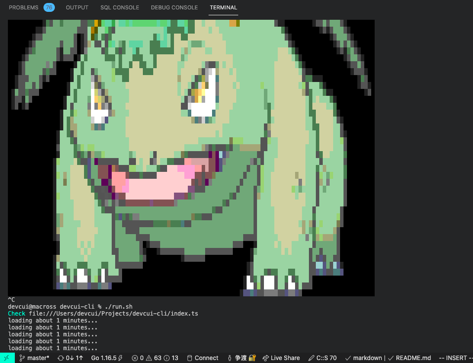

<!--
 * @Author: cuihaonan
 * @Email: devcui@outlook.com
 * @Date: 2021-07-15 15:50:56
 * @LastEditTime: 2021-07-15 16:30:08
 * @LastEditors: cuihaonan
 * @Description: Basic description
 * @FilePath: /devcui-cli/README.md
 * @LICENSE: NONE
-->

# Preview


# What

render `png` files into the terminal with <a href="https://deno.land/">Deno</a>
# Usage

```
deno run --unstable --allow-read ./index.ts 
```

# Reference resources

<a href="http://www.alloyteam.com/2017/03/the-story-of-png-get-images-and-pixel-content/"> alloyteam</a>  


<a href="https://www.w3.org/TR/PNG/#9FtIntro"> png protocol</a>